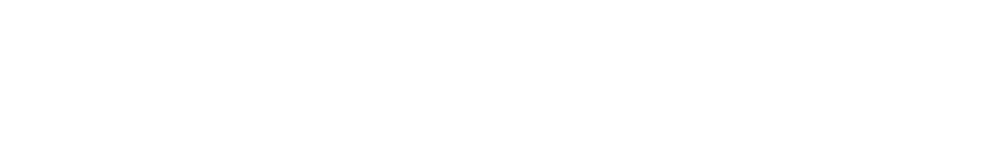

<!-- markdownlint-disable MD033 MD041 -->

<div align="center">
    <p>
        <a href="https://site.ccp.2hoch1.dev/">
            
            
        </a>
    </p>
    <p>
        <a href="https://github.com/copiedcopypasta/dmwt_WoOS/actions/workflows/ci.yml">
            
        </a>
        <a href="https://github.com/copiedcopypasta/dmwt_WoOS/deployments/Production">
            
        </a>
        
        
    </p>
</div>

<!-- markdownlint-enable MD033 -->

## About

Built with **Next.js**, this website aims to help users make more informed technology decisions by:

- Reducing unnecessary device purchases
- Comparing operating systems with a focus on efficiency
- Exploring techniques for building performant and resource-aware software

### Links

- [Website][website] (_work in progress_)
- [Organization][org]

### Disclaimer

> [!CAUTION]
> This project is **not affiliated with any real company** and was created **solely for academic purposes**.  
> The information provided may contain **inaccuracies**. Always **verify independently** before using or sharing any content.

## Exercise

This project was developed as part of a **university exercise**, focusing on:

1. `Plan`: Plan and structure a modern web application
2. `Storyline`: Create a story line for your website
3. `Components`: Plan a components overview
4. `Design`: Choose a theme and fonts
5. `Concepts`: Create concepts for your website
6. `Sustainability`: Apply sustainable and performance-aware design concepts
7. `Evaluation`: Evaluate technical decisions critically
8. `Presentation`: The project will be presented at the end of **January 19**.

## Progress

- Base project setup completed
- Application deployable via **Vercel**
- CI workflows configured
- Custom theme created
- User personas defined
- Concept creation for:
  - Animations
  - Images and icons
  - Layouts and themes
- Core components implemented
- Landing page created
- Page layout structure established

> For a full and technical changelog, you can find it under the [Changelog][changelog].

## Tools We Use

- `Next.js` ([source][nextjs]) – React framework for production-ready web apps
- `React` ([source][react]) – UI library
- `TypeScript` ([source][typescript]) – Type-safe JavaScript
- `Prisma` ([source][prisma]) – Database ORM
- `ESLint` ([source][eslint]) – Code linting
- `Prettier` ([source][prettier]) – Code formatting
- `GitHub Actions` ([source][gha]) – CI workflows
- `Vercel` ([source][vercel]) – Hosting and deployment
- `@2hoch1/pixel-icon-library-react` ([source][pixel-react]) – Pixel-style icon library for React

### Additions

To support the use of **pixel-style icons**, we created a dedicated **React library** that allows easy and consistent icon usage throughout the project.

- `@2hoch1/pixel-icon-library-react` ([source][pixel-react]) – React wrapper
- Pixel Icon Library ([source][pixel-lib-site]) – Original icon set
- Base NPM package ([source][pixel-lib-npm]) – Upstream implementation

### Usage

<!-- prettier-ignore-start -->

```tsx
import React from 'react';
import { AlertTriangle, RotateCw, Home, AlertTriangleSolid, HomeBrands } from '@2hoch1/pixel-icon-library-react';

export function MyComponent() {
  return (
    <div>
      {/* Regular variant (default) */}
      <AlertTriangle size={24} color="currentColor" />
      
      {/* Solid variant */}
      <AlertTriangleSolid size={24} />
      
      {/* Brands variant */}
      <HomeBrands size={24} />
      
      {/* Custom size and color */}
      <RotateCw size={32} color="blue" strokeWidth={2} />
    </div>
  );
}
```

<!-- prettier-ignore-end -->

## Contributing

At this time, contributions from third parties are **not permitted before January 30 of this year**, as the project is currently in its pre-submission phase. After that date, you are free to copy, fork, modify, and use this project in accordance with the license.

### Contributors

- [Craemon][craemon]
- [dev2xJJ][dev]
- [pallepalinski][palle]
- [2hoch1][21]

## License

This project is licensed under the [MIT License][license].

[website]: https://site.ccp.2hoch1.dev
[org]: https://github.com/copiedcopypasta
[license]: LICENSE
[changelog]: CHANGELOG.md
[craemon]: https://github.com/Craemon
[dev]: https://github.com/dev2xJJ
[palle]: https://github.com/pallepalinski
[21]: https://github.com/2hoch1
[nextjs]: https://github.com/vercel/next.js
[react]: https://github.com/facebook/react
[typescript]: https://github.com/microsoft/TypeScript
[prisma]: https://github.com/prisma/prisma
[eslint]: https://github.com/eslint/eslint
[prettier]: https://github.com/prettier/prettier
[gha]: https://github.com/features/actions
[vercel]: https://vercel.com
[pixel-react]: https://github.com/2hoch1/pixel-icon-library-react
[pixel-lib-site]: https://github.com/2hoch1/pixel-icon-library
[pixel-lib-npm]: https://www.npmjs.com/package/@2hoch1/pixel-icon-library-react
