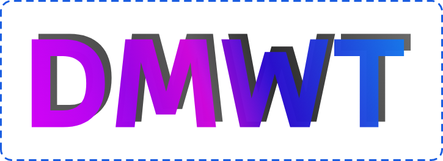

<!-- markdownlint-disable MD033 MD041 -->

    

        
    

    

        
        
        
        
    

<!-- markdownlint-enable MD033 -->

## About

**A website designed with Green IT principles, built with Next.js.**

This project helps you make more sustainable tech decisions: reduce unnecessary device purchases, choose and compare energy‑efficient operating systems, and adopt development practices that make software run faster while using less power.

> [!IMPORTANT] > **This project was created as part of a university course.**

## Links

- [Website][website] (_work in progress_)
- [API][api] (_work in progress_)

## Disclaimer

This project is not affiliated with a real company and was created for academic purposes. The information may contain inaccuracies. Please verify independently before using or reproducing any content.

## License

This project is licensed under the [MIT License][license].

[website]: https://site.ccp.2hoch1.dev
[api]: https://api.ccp.2hoch1.dev
[license]: LICENSE
